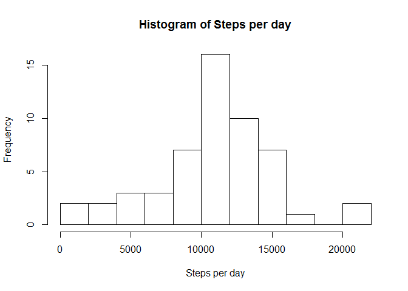
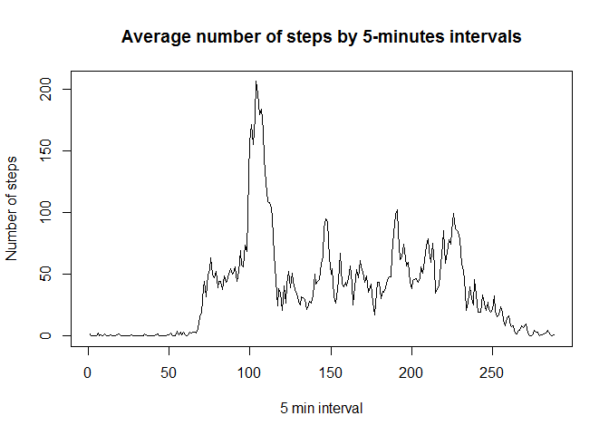
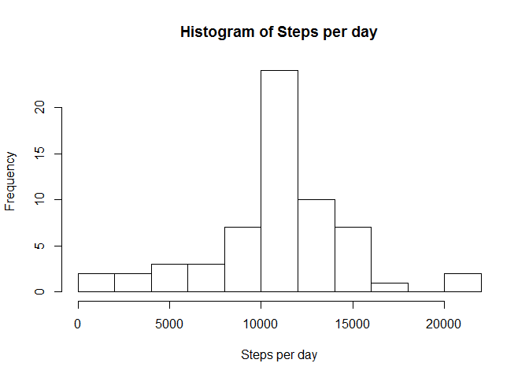
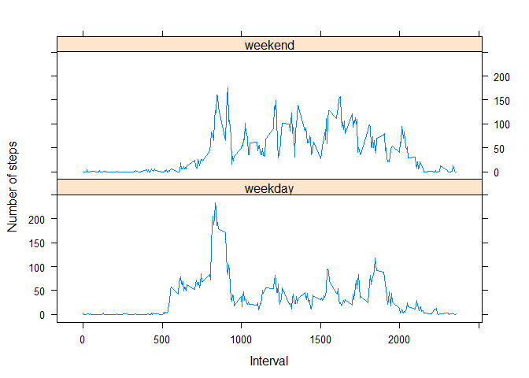

# Reproducible Research: Peer Assessment 1


## Loading and preprocessing the data

---

**Load the data and process/transform the data (if necessary) into a format suitable for your analysis**

We start by reading the file into a variable and cleaning it from NA values

```r
data_original <- read.csv("activity.csv")
data <- na.omit(data_original)
```

## What is mean total number of steps taken per day?

**Calculate the total number of steps taken per day**

We create a data frame obtaining the steps taken per day  


```r
library(plyr)
steps_per_day <- ddply(data, .(date), summarize, steps=sum(steps))
```

And it looks like this:


```r
head(steps_per_day)
```

```
##         date steps
## 1 2012-10-02   126
## 2 2012-10-03 11352
## 3 2012-10-04 12116
## 4 2012-10-05 13294
## 5 2012-10-06 15420
## 6 2012-10-07 11015
```

**Make a histogram of the total number of steps taken each day**


```r
hist(steps_per_day$steps, breaks = 10, main = "Histogram of Steps per day", xlab = "Steps per day")
```

 

**Calculate and report the mean and median of the total number of steps taken per day**

The mean:


```r
mean(steps_per_day$steps)
```

```
## [1] 10766.19
```

And the median:


```r
median(steps_per_day$steps)
```

```
## [1] 10765
```


## What is the average daily activity pattern?

**Make a time series plot of the 5-minute interval (x-axis) and the average number of steps taken, averaged across all days (y-axis)**

We need to create a new date frame for this:


```r
steps_interval <- ddply(data, .(interval), summarize, steps=mean(steps))
```

And now we can plot it


```r
plot(steps_interval$steps, type = "l", xlab = "5 min interval", ylab = "Number of steps", main = "Average number of steps by 5-minutes intervals")
```

 

**Which 5-minute interval, on average across all the days in the dataset, contains the maximum number of steps?**

The 835th time interval:


```r
steps_interval$interval[which.max(steps_interval$steps)]
```

```
## [1] 835
```


## Imputing missing values

**Calculate and report the total number of missing values in the dataset (i.e. the total number of rows with NAs)**

2304 missing values:


```r
sum(is.na(data_original$steps))
```

```
## [1] 2304
```

**Devise a strategy for filling in all of the missing values in the dataset. The strategy does not need to be sophisticated. For example, you could use the mean/median for that day, or the mean for that 5-minute interval, etc.**

I decided to fill the missing values with the mean of the day, as suggested. To do so, first I need a data frame with the steps mean per day:


```r
steps_mean <- ddply(data_original, .(date), summarize, steps=mean(steps))
head(steps_mean)
```

```
##         date    steps
## 1 2012-10-01       NA
## 2 2012-10-02  0.43750
## 3 2012-10-03 39.41667
## 4 2012-10-04 42.06944
## 5 2012-10-05 46.15972
## 6 2012-10-06 53.54167
```

Now get get the positions where there are NA's


```r
na_pos <- which(is.na(data_original$steps))
head(na_pos)
```

```
## [1] 1 2 3 4 5 6
```

If we find that for a particular date we do not have a mean, because all the values in that date are NA, then we fill it with the global mean. Else, we will fill them with the mean of that date.


```r
mean_steps <- mean(na.omit(steps_mean$steps))
mean_steps
```

```
## [1] 37.3826
```

**Create a new dataset that is equal to the original dataset but with the missing data filled in.**


```r
#new data will be stored in this new data frame to avoid confussion with variable names.
data_filled <- data_original
for (i in na_pos){
  if (is.na(steps_mean$steps[steps_mean$date == as.character(data_original$date[i])])){
    data_filled$steps[i] <- mean_steps
	}
	else{
    data_filled$steps[i] <- steps_mean$steps[steps_mean$date == as.character(data_original$date[i])]
	}
}
```

**Make a histogram of the total number of steps taken each day and Calculate and report the mean and median total number of steps taken per day. Do these values differ from the estimates from the first part of the assignment? What is the impact of imputing missing data on the estimates of the total daily number of steps?**


```r
steps_per_day2 <- ddply(data_filled, .(date), summarize, steps=sum(steps))
hist(steps_per_day2$steps, breaks = 10, main = "Histogram of Steps per day", xlab = "Steps per day")
```

 

```r
mean(steps_per_day2$steps)
```

```
## [1] 10766.19
```

```r
median(steps_per_day2$steps)
```

```
## [1] 10766.19
```

As we can see, the mean and the median are now the same which is something we may expect as we have approached both values by filling the NA's with the mean of the day or with the global mean in case there is no mean for that day. 

## Are there differences in activity patterns between weekdays and weekends?

**Create a new factor variable in the dataset with two levels - "weekday" and "weekend" indicating whether a given date is a weekday or weekend day.**

We add new column to the data set with this information


```r
data$day <- "weekday" 
data$day[weekdays(as.Date(data$date)) %in% c("sábado","domingo")] <- "weekend"
table(data$day)
```

```
## 
## weekday weekend 
##   11232    4032
```

**Make a panel plot containing a time series plot (i.e. type = "l") of the 5-minute interval (x-axis) and the average number of steps taken, averaged across all weekday days or weekend days (y-axis). See the README file in the GitHub repository to see an example of what this plot should look like using simulated data.**

The graph shows more activity as an average during weekdays, but with maximums in weekends.


```r
steps_day_interval <- ddply(data, c("interval","day"), summarize, steps=mean(steps))
library("lattice")
xyplot(type="l", data=steps_day_interval, steps ~ interval | day, xlab="Interval", ylab="Number of steps", layout=c(1,2))
```

 


